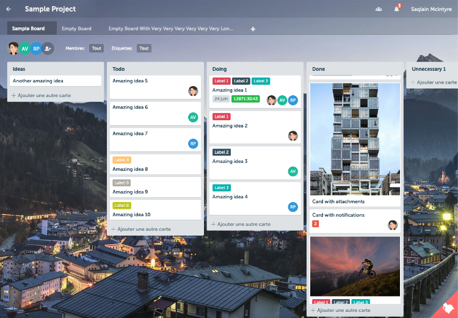

<!--
NOTA: Este README foi creado automáticamente por <https://github.com/YunoHost/apps/tree/master/tools/readme_generator>
NON debe editarse manualmente.
-->

# Planka para YunoHost

[](https://ci-apps.yunohost.org/ci/apps/planka/)  

[](https://install-app.yunohost.org/?app=planka)

*[Le este README en outros idiomas.](./ALL_README.md)*

> *Este paquete permíteche instalar Planka de xeito rápido e doado nun servidor YunoHost.*  
> *Se non usas YunoHost, le a [documentación](https://yunohost.org/install) para saber como instalalo.*

## Vista xeral

Elegant open source project tracking.

### Features

- Create projects, boards, lists, cards, labels and tasks
- Add card members, track time, set a due date, add attachments, write comments
- Markdown support in a card description and comment
- Filter by members and labels
- Customize project background
- Real-time updates
- User notifications
- Internationalization


**Versión proporcionada:** 1.24.2~ynh1

**Demo:** <https://plankanban.github.io/planka/#/>

## Capturas de pantalla



## Documentación e recursos

- Web oficial da app: <https://planka.app/>
- Documentación oficial para admin: <https://docs.planka.cloud/docs/intro/>
- Repositorio de orixe do código: <https://github.com/plankanban/planka>
- Tenda YunoHost: <https://apps.yunohost.org/app/planka>
- Informar dun problema: <https://github.com/YunoHost-Apps/planka_ynh/issues>

## Info de desenvolvemento

Envía a túa colaboración á [rama `testing`](https://github.com/YunoHost-Apps/planka_ynh/tree/testing).

Para probar a rama `testing`, procede deste xeito:

```bash
sudo yunohost app install https://github.com/YunoHost-Apps/planka_ynh/tree/testing --debug
ou
sudo yunohost app upgrade planka -u https://github.com/YunoHost-Apps/planka_ynh/tree/testing --debug
```

**Máis info sobre o empaquetado da app:** <https://yunohost.org/packaging_apps>
